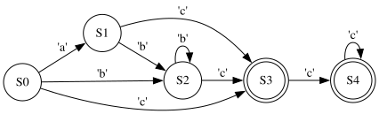

# Regex FSM
**Lab Assignment for Discrete Math Course**
**Author: Andrii Kryvyi**

A simple regex engine that compiles a regex pattern into a Finite State Machine (FSM) and checks whether a given string matches the pattern.

## Usage

Examples of usage are available in `examples.py` and `test.py`.

Supported regex features include:

* Quantifiers: `*`, `+`, `?`
* Character classes: `[abc]`, `[a-z]`
* Negated classes: `[^abc]`, `[^a-z]`
* Escaping of special characters

To use, create a `RegexFSM` object with the desired pattern:

```python
fsm = RegexFSM(pattern)
```

This compiles the regex into a Non-deterministic Finite Automaton (NFA), which can be used for matching.

## How It Works

### Token Definition

A **Token** is the fundamental unit used in this library. It follows a protocol requiring the implementation of the method:

```python
check(char: str) -> bool
```

This method determines whether a transition in the FSM is allowed for a given character.

### Parsing the Regular Expression

Parsing consists of two main steps:

#### 1. Tokenization

The pattern is read character by character and converted into a sequence (generator) of tokens or modifiers.
Character classes (e.g., `[a-z]`) are handled by the `ClassProcessor`. Escaping is also supported.

#### 2. Grouping

Each modifier (`*`, `+`, `?`) is grouped with the token that precedes it. Patterns with consecutive modifiers are invalid.

The `+` modifier is internally converted into `TT*` to simplify processing.
After grouping, the result is a generator of `(token, modifier)` tuples, where the modifier may be `None`.

### Compiling the NFA

* The compilation begins with an **initial state** and a list of **jump pointers** (initially pointing to the initial state).
* A **counter** is used to name each new state uniquely.
* For each `(token, modifier)` pair:

  * A new state is created and connected from the previous jump states using the token as the transition condition.
  * If no modifier is applied, the jump list is reset to the new state.
  * If `*` is used, a loop is created allowing zero or more repetitions, and the jump list is updated to include the new state.
  * If `?` is used, a non-looping optional transition is added.

At the end of the compilation, all states in the final jump list are marked as **terminal**, meaning reaching them indicates a successful match.

#### Example

For the pattern `a?b*c+`, the following NFA is generated:



More examples can be found in the `examples/` directory.

### Executing the NFA

* Execution begins at the initial state with a list of **current states**.
* For each character in the input string:

  * Transitions are checked for all current states.
  * If a transition is valid, the corresponding new state is added to the next state list.
  * A single `deque` is used for performance, with `None` markers separating each character's transitions.

After processing all characters, if any terminal state is present in the current state list, the string is considered a match.

## Future Improvements

* **Build a Syntax Tree**: Instead of parsing into tokens and modifiers directly, build a syntax tree for the pattern. This would allow parsing of more general regular expressions, including grouping (`(...)`) and alternation (`|`).
* **Convert NFA to DFA**: After building the NFA, convert it to a Deterministic Finite Automaton (DFA). This increases compile time but significantly improves matching speed and memory efficiency.

Would you like me to help convert this into a Markdown file or integrate a diagram rendering example in Python?
